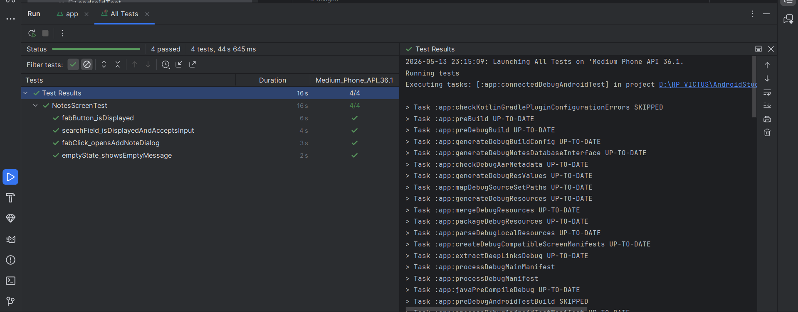

# Tugas 10 - Testing dan Dependency Injection
**Nama:** Andika Rahman Pratama  
**NIM:** 123140090  
**Prodi:** Teknik Informatika - ITERA

## Deskripsi
Aplikasi ini merupakan pengembangan dari Tugas 9 dengan penambahan **Dependency Injection (Koin)** yang direfactor menjadi 3 module terpisah, serta implementasi **Unit Test**, **Flow Test (Turbine)**, dan **UI Test (Compose Test)** secara menyeluruh.

### Fitur Tugas 10:
1. **Koin DI Refactoring:** Memecah `appModule` menjadi 3 module (`dataModule`, `networkModule`, `viewModelModule`) untuk separation of concerns yang lebih baik.
2. **Repository Interface:** Menambahkan `NoteRepositoryInterface` agar ViewModel bisa di-test tanpa bergantung pada database asli.
3. **Unit Test — NoteRepository (6 test cases):** Pengujian CRUD operations menggunakan MockK untuk mocking database.
4. **Unit Test — NotesViewModel (5 test cases):** Pengujian state management dan interaksi dengan repository menggunakan MockK.
5. **Flow Test — ChatViewModel (3 test cases):** Pengujian StateFlow menggunakan Turbine untuk memverifikasi perubahan UI state secara reaktif.
6. **UI Test — NotesScreen (4 test cases):** Pengujian tampilan menggunakan Compose Test Rule dengan Test Tags untuk identifikasi komponen.

### Tech Stack:
- **Language:** Kotlin
- **UI Framework:** Jetpack Compose + Material 3
- **DI Framework:** Koin 3.5.3
- **Testing:** JUnit 4, MockK 1.13.9, Turbine 1.2.0
- **Coroutines:** kotlinx-coroutines-test 1.7.3
- **UI Testing:** Compose UI Test
- **Database:** SQLDelight
- **HTTP Client:** Ktor Client

### Struktur File Baru (Tugas 10):
```
data/
└── NoteRepositoryInterface.kt   # Interface untuk mock repository di test

TestTags.kt                      # Konstanta test tag untuk UI testing

test/
├── data/
│   └── NoteRepositoryTest.kt    # 6 unit test untuk repository
└── viewmodel/
    ├── NotesViewModelTest.kt    # 5 unit test untuk ViewModel
    └── ChatViewModelFlowTest.kt # 3 flow test dengan Turbine

androidTest/
└── screens/
    └── NotesScreenTest.kt       # 4 UI test dengan Compose Test
```

### Daftar Test Cases:

| No | Test Case | Tipe | File |
|----|-----------|------|------|
| 1 | `getAllNotes returns flow from database` | Unit | NoteRepositoryTest.kt |
| 2 | `searchNotes returns flow from database` | Unit | NoteRepositoryTest.kt |
| 3 | `insertNote calls database insert` | Unit | NoteRepositoryTest.kt |
| 4 | `updateNote calls database update` | Unit | NoteRepositoryTest.kt |
| 5 | `deleteNote calls database delete` | Unit | NoteRepositoryTest.kt |
| 6 | `getNoteById calls database selectById` | Unit | NoteRepositoryTest.kt |
| 7 | `initial search query is empty string` | Unit | NotesViewModelTest.kt |
| 8 | `updateSearchQuery changes search state` | Unit | NotesViewModelTest.kt |
| 9 | `addNote calls repository insertNote` | Unit | NotesViewModelTest.kt |
| 10 | `deleteNote calls repository deleteNote` | Unit | NotesViewModelTest.kt |
| 11 | `updateNote calls repository updateNote` | Unit | NotesViewModelTest.kt |
| 12 | `initial uiState has empty messages` | Flow | ChatViewModelFlowTest.kt |
| 13 | `kirimPesan adds user message to state` | Flow | ChatViewModelFlowTest.kt |
| 14 | `resetChat clears all messages` | Flow | ChatViewModelFlowTest.kt |
| 15 | `emptyState shows empty message` | UI | NotesScreenTest.kt |
| 16 | `fab button is displayed` | UI | NotesScreenTest.kt |
| 17 | `search field accepts input` | UI | NotesScreenTest.kt |
| 18 | `fab click opens add note dialog` | UI | NotesScreenTest.kt |

### Cara Menjalankan Test:
```bash
# Unit Test + Flow Test
./gradlew testDebugUnitTest

# UI Test (butuh emulator)
./gradlew connectedDebugAndroidTest
```

## Video Demo
[Video Demo Tugas 10](https://drive.google.com/file/d/135H1AlIHfDQ0fpKz3ynBGU7PCubI5Gs-/view?usp=sharing)

## Showcase

### Hasil Pengujian (Tugas 10)
| Unit Test (14 Passed) | UI Test (4 Passed) |
| :---: | :---: |
| .png) |  |