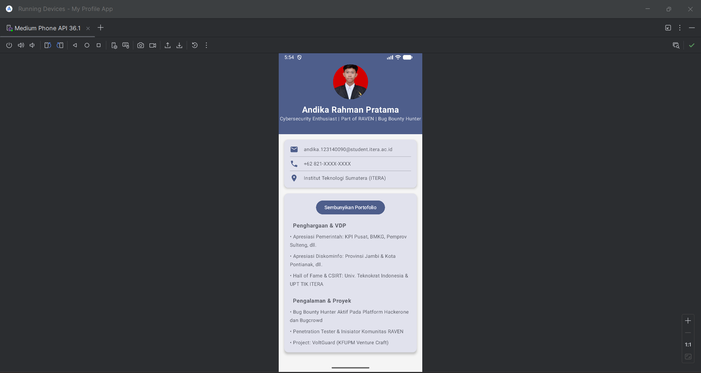

# Tugas 3 PAM: My Profile App

Tugas Pertemuan 3 - Mata Kuliah Pengembangan Aplikasi Mobile (PAM)
Program Studi Teknik Informatika, Institut Teknologi Sumatera (ITERA)

**Oleh:**
* **Nama:** Andika Rahman Pratama
* **NIM:** 123140090

---

##  Deskripsi Proyek
Aplikasi **My Profile App** ini dibangun menggunakan Jetpack Compose / Compose Multiplatform dengan mengimplementasikan paradigma UI Deklaratif. Aplikasi ini menampilkan profil digital profesional, informasi kontak, dan rekam jejak portofolio di bidang keamanan siber (*cybersecurity*).

##  Fitur & Implementasi (Sesuai Rubrik Penilaian)
Aplikasi ini telah memenuhi seluruh kriteria wajib dan bonus dari tugas praktikum:
- [x] **Layout Implementation:** Menggunakan kombinasi `Column`, `Row`, dan `Box` untuk menyusun tata letak.
- [x] **Reusable Composables (Min. 3):** Terdiri dari fungsi custom `ProfileHeader()`, `InfoCard()`, `InfoItem()`, dan `PortfolioCard()`.
- [x] **UI Components & Modifiers:** Menggunakan komponen bawaan seperti `Text`, `Button`, `Icon`, `Card`, serta modifikasi *styling* dan *positioning* menggunakan `Modifier`.
- [x] **BONUS (+10%):** Mengimplementasikan komponen interaktif dengan animasi menggunakan `AnimatedVisibility` pada bagian *PortfolioCard* untuk menyembunyikan/menampilkan rekam jejak pengalaman.

---

##  Screenshot Aplikasi

---