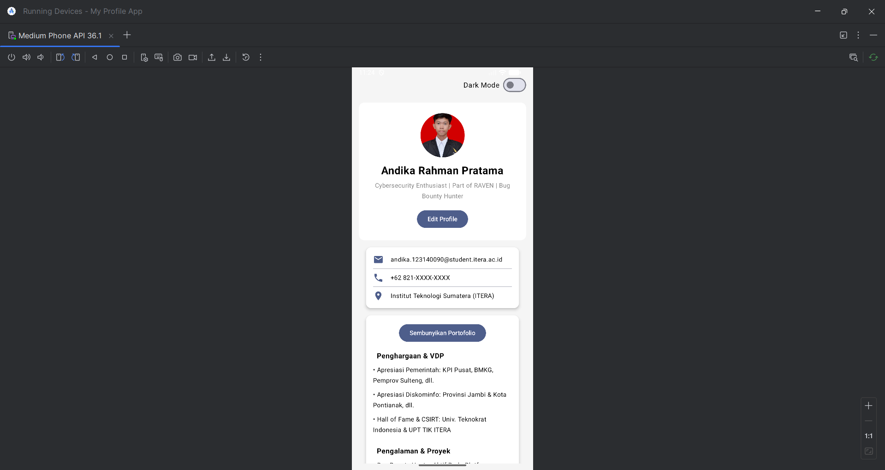
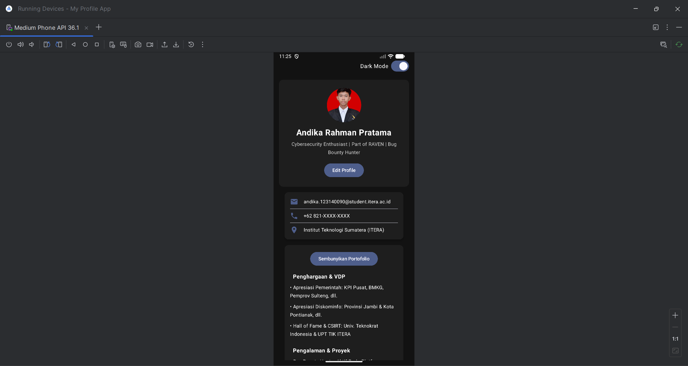
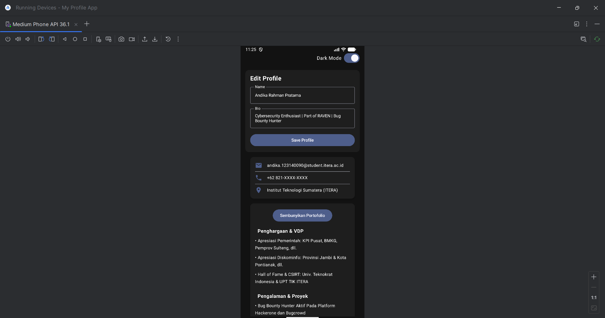

# Tugas 4 PAM - My Profile App (MVVM & State Management)

Tugas Pertemuan 3 - Mata Kuliah Pengembangan Aplikasi Mobile (PAM)
Program Studi Teknik Informatika, Institut Teknologi Sumatera (ITERA)

**Oleh:**
* **Nama:** Andika Rahman Pratama
* **NIM:** 123140090

---

##  Deskripsi Proyek
Repositori ini berisi hasil pengerjaan Tugas Praktikum Pertemuan 4 mata kuliah Pengembangan Aplikasi Mobile (PAM) Aplikasi "My Profile App" yang sebelumnya statis telah di-refactor menjadi aplikasi reaktif menggunakan arsitektur **MVVM (Model-View-ViewModel)** dan **State Management** pada Jetpack Compose

---

## Fitur Utama & Pemenuhan Kriteria
Sesuai dengan instruksi penugasan, aplikasi ini memuat fitur dan struktur berikut:
1. **Implementasi MVVM Pattern**: Memisahkan logika bisnis dari UI menggunakan `ProfileViewModel` dengan `StateFlow`, serta mendefinisikan *State* menggunakan Data class `ProfileUiState`.
2. **Fitur Edit Profile & State Hoisting**: Form interaktif untuk mengubah Nama dan Bio. Mengimplementasikan *Stateless Component* (`LabeledTextField`) dengan konsep *State Hoisting*, di mana *event* perubahan dikirim ke ViewModel.
3. **Struktur Direktori (Clean Code)**: File diorganisasikan ke dalam direktori terpisah yaitu `ui/`, `viewmodel/`, dan `data/` agar kode lebih terstruktur dan *maintainable*.
4. **BONUS (+10%): Dark Mode Toggle**: Terdapat *switch* untuk mengaktifkan mode gelap/terang. State *dark mode* disimpan di ViewModel dan transisi pergantian tema (background utama, *Card*, dan warna teks) dibuat sangat *smooth* menggunakan animasi *state*.

---

## Struktur Folder
```
app/src/main/java/com/.../myprofileapp/
 ├── data/
 │    └── ProfileUiState.kt
 ├── ui/
 │    └── ProfileScreen.kt
 ├── viewmodel/
 │    └── ProfileViewModel.kt
 └── MainActivity.kt
 ```

---

##  Screenshot Aplikasi





---