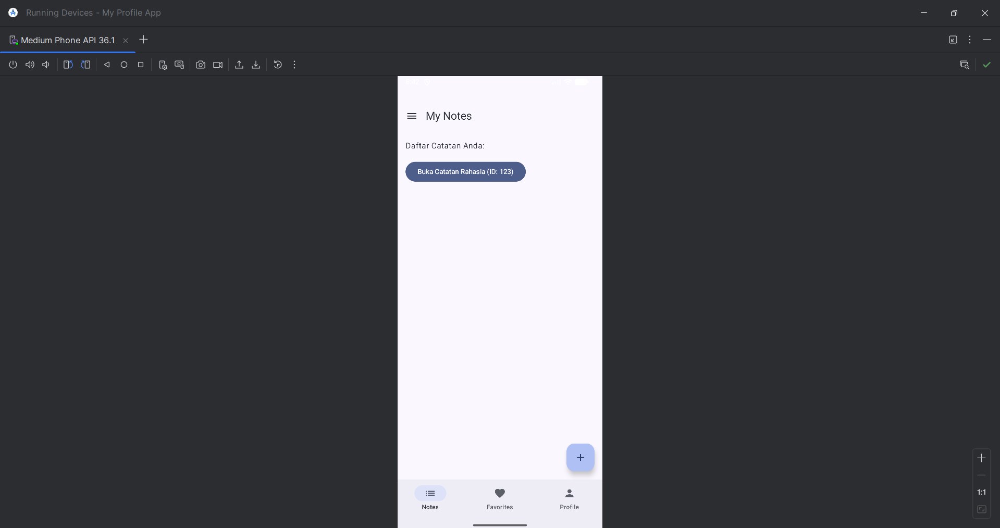
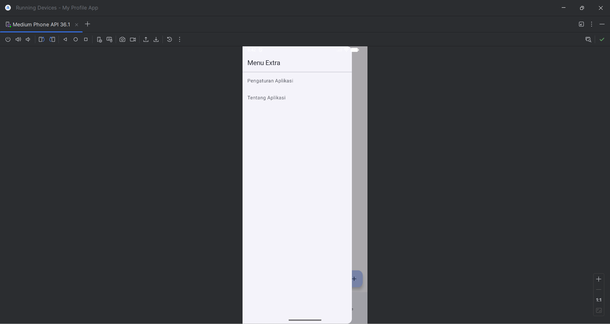
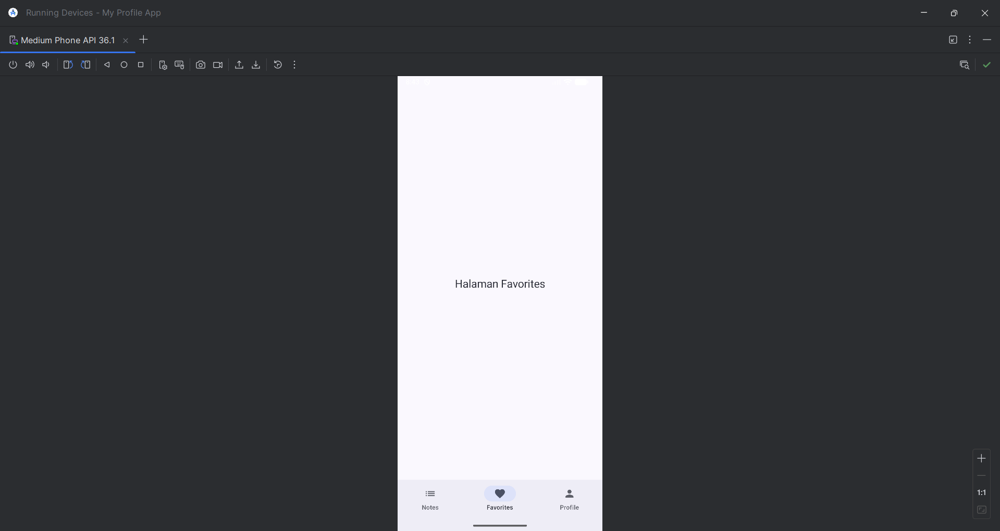
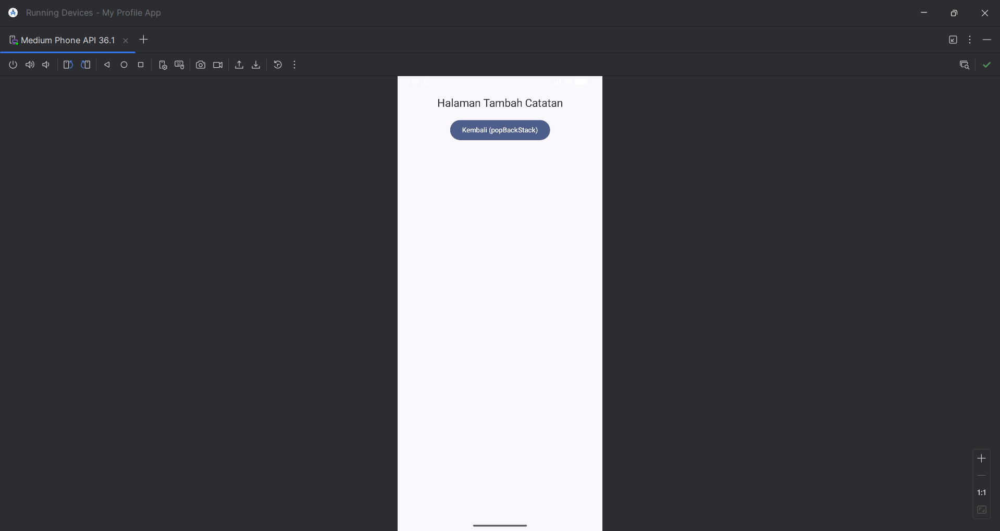
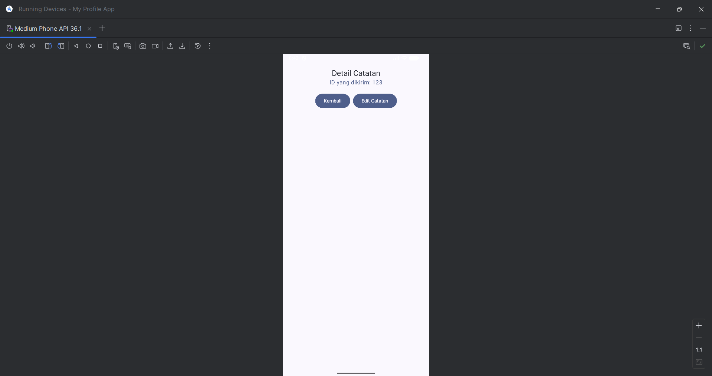

# Tugas 5 PAM - Navigasi Antar Layar (Notes App)

**Nama:** Andika Rahman Pratama  
**NIM:** 123140090

## Deskripsi Tugas
Repositori ini berisi hasil pengerjaan Tugas Praktikum Pertemuan 5 mata kuliah Pengembangan Aplikasi Mobile (PAM). Aplikasi ini mengimplementasikan konsep navigasi multi-layar menggunakan **Navigation Component** pada Jetpack Compose. Fitur `ProfileScreen` dari tugas sebelumnya telah diintegrasikan sebagai salah satu bagian dari navigasi utama.

## Fitur & Pemenuhan Kriteria
Sesuai dengan rubrik penilaian, aplikasi ini memuat fitur berikut:
1. **Bottom Navigation**: Terdiri dari 3 tab utama (Notes, Favorites, Profile) yang diatur menggunakan `Scaffold` dan `NavigationBar`.
2. **Navigation with Arguments**: Implementasi pengiriman data (`noteId`) secara dinamis dari Note List ke Note Detail dan Edit Note.
3. **Navigation Flow & Back Stack**: Menggunakan `Maps()` untuk maju dan `popBackStack()` untuk kembali secara terstruktur, termasuk tombol Floating Action Button (FAB) untuk navigasi ke halaman Add Note.
4. **Struktur Clean Code**: Pengorganisasian folder ke dalam `navigation/`, `screens/`, dan `components/` menggunakan `sealed class` untuk manajemen rute terpusat.
5. **BONUS (+10%) - Navigation Drawer**: Menggunakan `ModalNavigationDrawer` yang dapat diakses melalui tombol menu di TopAppBar halaman Notes.

## Screenshot Aplikasi

Berikut adalah dokumentasi tampilan *flow* navigasi aplikasi:

|    My Notes & FAB     |   Navigation Drawer   |        Favorites Tab        |  Add Note View  |  Note Detail (Args)   |
|:---------------------:|:---------------------:|:---------------------------:|:---------------:|:---------------------:|
|  |  |  |  |  |

## Video Demo
Silakan tonton demonstrasi alur navigasi aplikasi (Tab switching, Drawer, Add Note, dan Passing Arguments) pada tautan berikut:
**[https://drive.google.com/file/d/1GCP3kaU1x1kAbG6pQAHKWq8c7k-rX4gR/view?usp=sharing]**