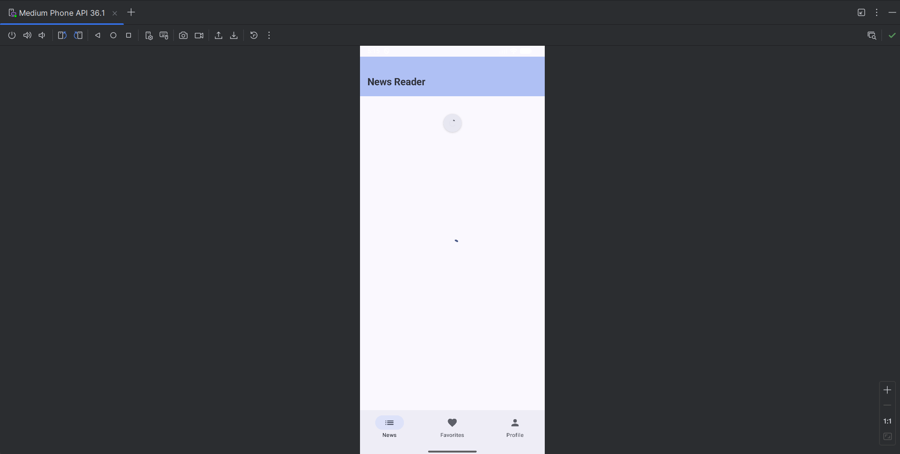
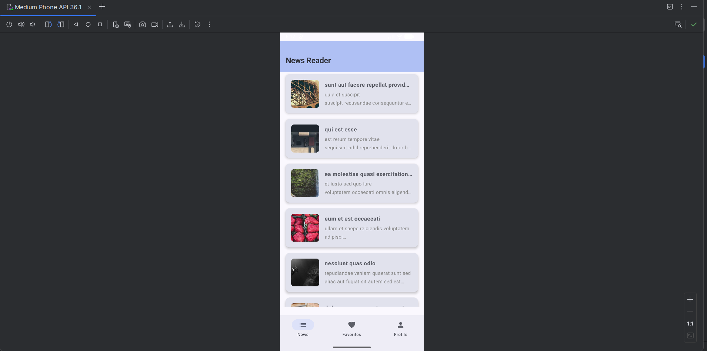
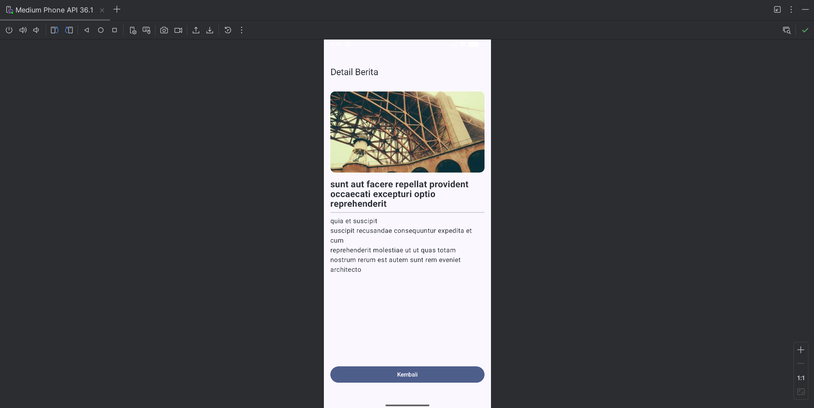
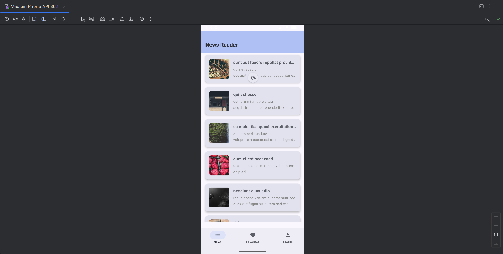
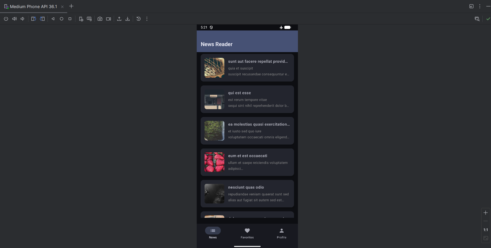
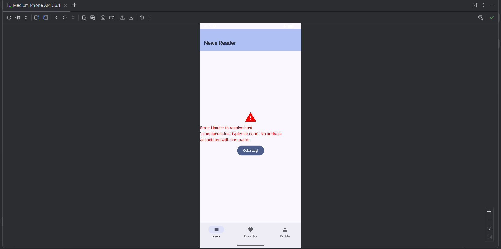

# NewsFeed - News Reader App 📰
**Tugas 6 Praktikum Pengembangan Aplikasi Mobile**

Aplikasi pembaca berita sederhana yang mengimplementasikan Networking (REST API), Repository Pattern, State Management, dan Offline Caching.

## 👤 Identitas Mahasiswa
- **Nama:** Andika Rahman Pratama
- **NIM:** 123140090
- **Kelas:** Praktikum PAM

## 🚀 Fitur Utama
Aplikasi ini dibangun dengan memenuhi seluruh kriteria tugas, yaitu:
1. **Networking (REST API):** Menarik data berita secara real-time dari JSONPlaceholder API menggunakan Ktor Client.
2. **Repository Pattern:** Arsitektur kode yang rapi dengan memisahkan logika pengambilan data (Data Source) dari ViewModel.
3. **State Management:** Menggunakan `UiState` (Loading, Success, Error) untuk menangani perubahan kondisi layar.
4. **Pull-to-Refresh:** Fitur untuk memperbarui daftar berita dengan menarik layar ke bawah (Material 3 `PullToRefreshBox`).
5. **Navigation:** Navigasi antara List Berita, Detail Berita, dan Tab Menu menggunakan Compose Navigation.
6. **[BONUS 10%] Offline Caching:** Mengimplementasikan caching menggunakan `SharedPreferences`. Berita tetap dapat diakses meskipun perangkat dalam keadaan offline (tanpa koneksi internet).

## 🛠️ Tech Stack
- **Language:** Kotlin
- **UI Framework:** Jetpack Compose (Material 3)
- **Networking:** Ktor Client (Engine: OkHttp)
- **Serialization:** Kotlinx Serialization
- **Image Loading:** Coil Compose
- **Concurrency:** Kotlin Coroutines & Flow

## 🌐 API Reference
Aplikasi ini menggunakan public API gratis untuk keperluan testing:
- **Base URL:** `https://jsonplaceholder.typicode.com/posts`
- **Images:** `https://picsum.photos` (Placeholder images)

## 📸 Screenshots

| Loading State | News List (Success) | News Detail |
| :---: | :---: | :---: |
|  |  |  |

| Pull to Refresh | Offline Mode (Cache) | Error State |
| :---: | :---: | :---: |
|  |  |  |

## Video Demo
Silakan tonton demonstrasi aplikasi pada tautan berikut:
**[https://drive.google.com/file/d/1B3hKePTvHl6LM9gct5Iw4FDlkxGTuuE2/view?usp=sharing]**

## 📦 Cara Menjalankan
1. Clone repository ini.
2. Pastikan internet aktif untuk pertama kali menjalankan aplikasi (untuk download dependencies & fetch API).
3. Jalankan melalui Android Studio (Chipmunk atau yang lebih baru).
4. Untuk mengetes **Offline Caching**, jalankan aplikasi satu kali, lalu matikan koneksi internet (Airplane Mode) dan buka kembali aplikasinya.