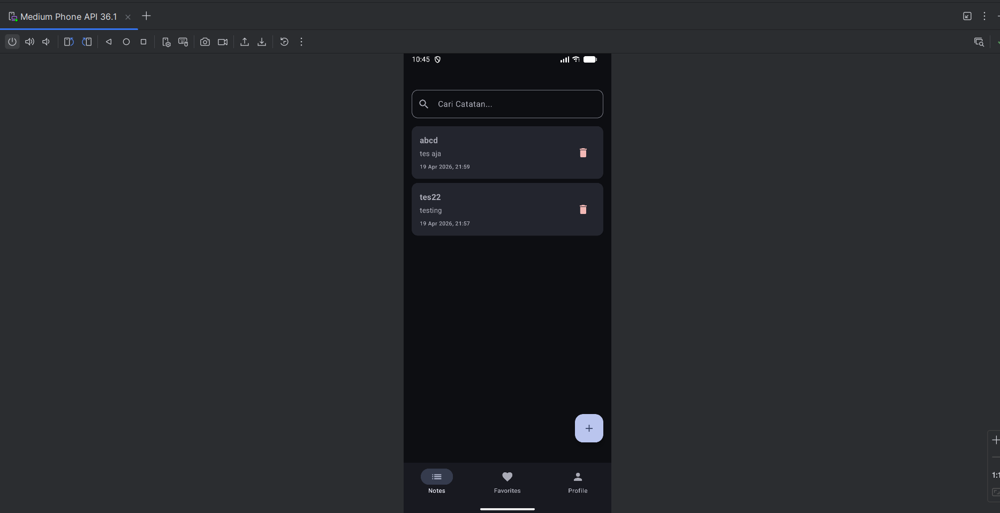
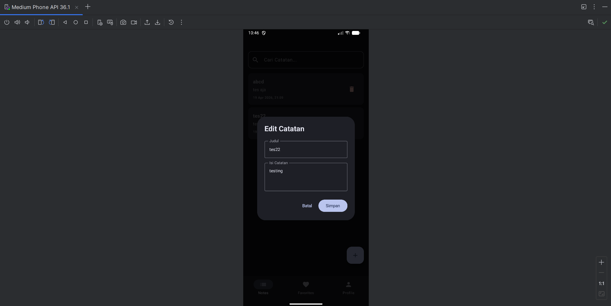
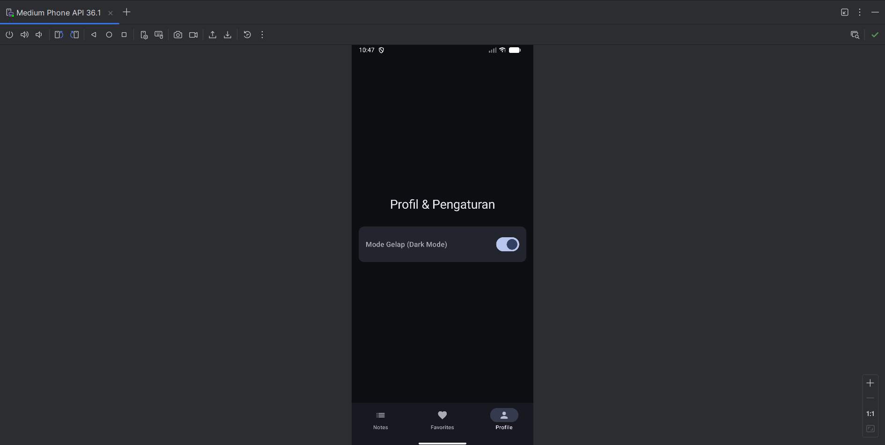

# Tugas 7 PAM - Local Data Storage (Notes App)

**Nama:** Andika Rahman Pratama  
**NIM:** 123140090

## Deskripsi Tugas
Repositori ini berisi hasil pengerjaan Tugas Praktikum Pertemuan 7 mata kuliah Pengembangan Aplikasi Mobile (PAM). Aplikasi ini mengimplementasikan konsep penyimpanan data lokal (Local Data Storage) menggunakan **SQLDelight** dan **Jetpack DataStore** pada Jetpack Compose. Aplikasi ini juga telah di- *upgrade* dengan mengusung arsitektur *Offline-First* agar tetap responsif tanpa koneksi internet.

## Fitur & Pemenuhan Kriteria
Sesuai dengan rubrik penilaian tugas minggu ke-7, aplikasi ini memuat fitur berikut:
1. **SQLDelight Setup & CRUD Operations**: Implementasi *database* SQLite yang *type-safe* menggunakan SQLDelight untuk melakukan *Create, Read, Update, dan Delete* catatan secara lokal.
2. **Search Feature**: Fitur pencarian catatan secara *real-time* menggunakan `StateFlow` yang memfilter catatan berdasarkan input teks tanpa *lag*.
3. **DataStore Settings**: Menyimpan preferensi tema aplikasi (Switch Mode Gelap/Terang) di halaman Profile secara permanen menggunakan *DataStore Preferences*.
4. **UI States & Offline-First**: Aplikasi selalu menampilkan data dari lokal terlebih dahulu. Implementasi UI dibuat lebih bersih menggunakan *Pop-up Dialog* (Modal) untuk menambah dan mengedit catatan.
5. **BONUS (+10%) - Sync dengan Remote API**: Mengimplementasikan simulasi *background sync* ke Remote API (GET dan POST) menggunakan Kotlin Coroutines untuk menunjukkan penerapan *Offline-First Architecture* yang utuh.

## Screenshot Aplikasi

Berikut adalah dokumentasi tampilan fitur penyimpanan data lokal aplikasi:

| Daftar Catatan & Pencarian | Pop-up Add/Edit Catatan | Profil & Setting DataStore | Log Background API Sync |
|:--------------------------:|:-----------------------:|:--------------------------:|:-----------------------:|
|       |      |   |      |

## Video Demo
Silakan tonton demonstrasi fitur aplikasi (Operasi CRUD, Real-time Search, DataStore Dark Mode, dan Simulasi Background Sync API) pada tautan berikut:
**[https://drive.google.com/file/d/17zqqKwo8wMO6XYAyD4WQUGnRndy-uMmt/view?usp=sharing]**