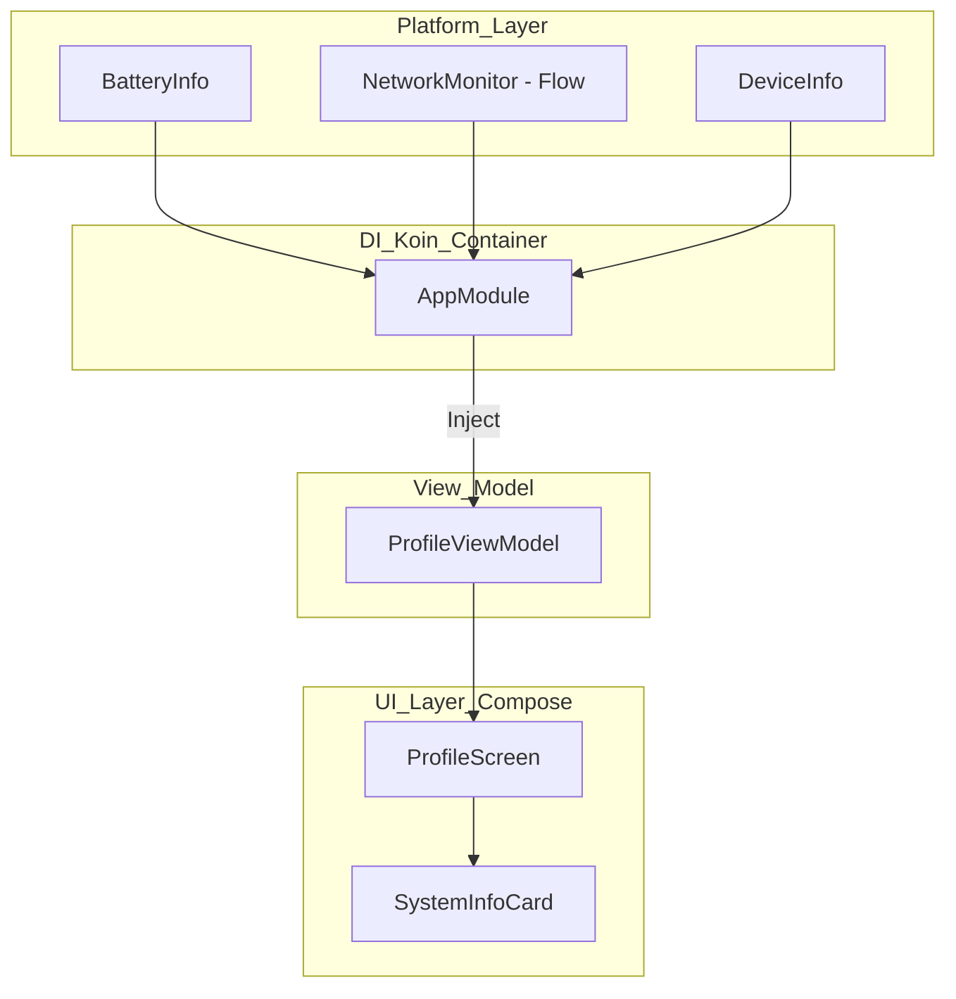
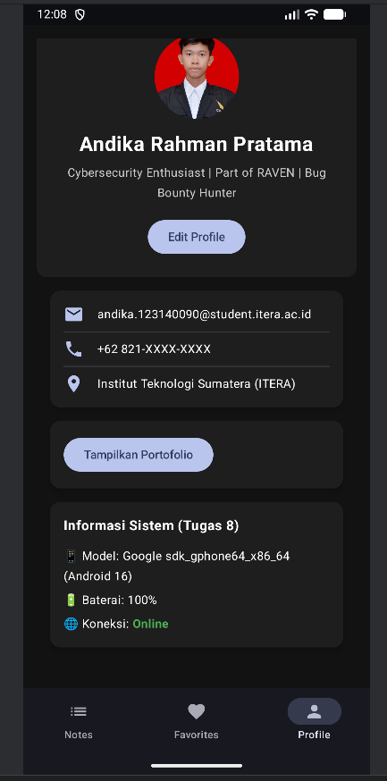
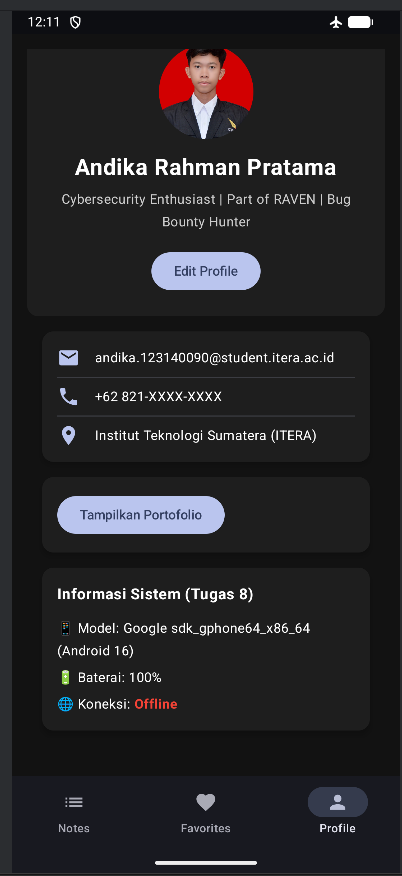

# Tugas 8 - Pengembangan Aplikasi Mobile
**Nama:** Andika Rahman Pratama  
**NIM:** 123140090  
**Prodi:** Teknik Informatika - ITERA

## Fitur Tugas 8 (Platform API & Dependency Injection)
Aplikasi ini merupakan pengembangan dari Tugas 7 dengan penambahan fitur akses perangkat keras (Platform API) dan implementasi Dependency Injection menggunakan Koin.

### Fitur Utama:
1. **Dependency Injection (Koin):** Implementasi Koin untuk manajemen *lifecycle* ViewModel dan injeksi sensor platform secara otomatis.
2. **Device Information:** Menampilkan informasi model perangkat dan versi Android secara akurat.
3. **Battery Monitoring:** Menampilkan level baterai perangkat secara *real-time*.
4. **Real-time Network Monitoring (Reactive):** Menggunakan `callbackFlow` dan `StateFlow` untuk mendeteksi perubahan status koneksi (Online/Offline) secara instan tanpa perlu memuat ulang halaman.
5. **Modern UI/UX:** Integrasi fitur sensor ke dalam halaman Profil dengan dukungan Dark Mode dan animasi transisi warna.

### Tech Stack:
- **Language:** Kotlin
- **UI Framework:** Jetpack Compose
- **DI Framework:** Koin
- **Asynchronous:** Kotlin Coroutines & Flow
- **Local Storage:** Room Database (Tugas 7 Base)

##  Showcase

| Device Info & Battery | Real-time Network (Online) | Network (Offline) |
| :---: | :---: | :---: |
|  |  |  |

> **Note:** Status koneksi berubah secara reaktif menggunakan Kotlin Flow tanpa perlu melakukan refresh halaman.