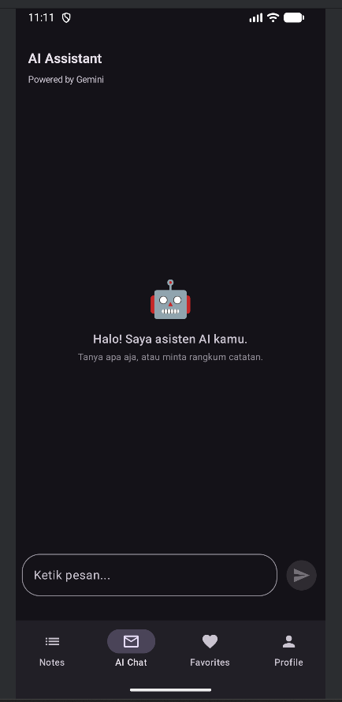
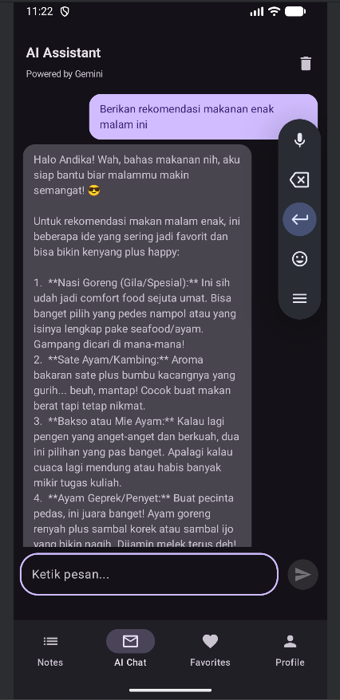
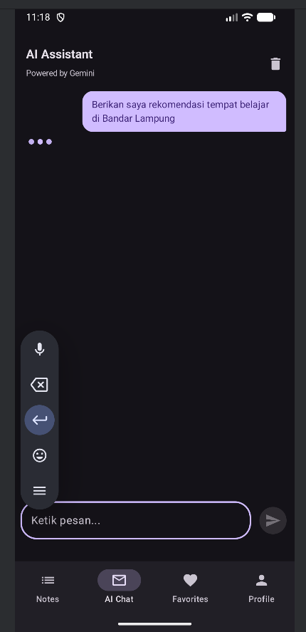
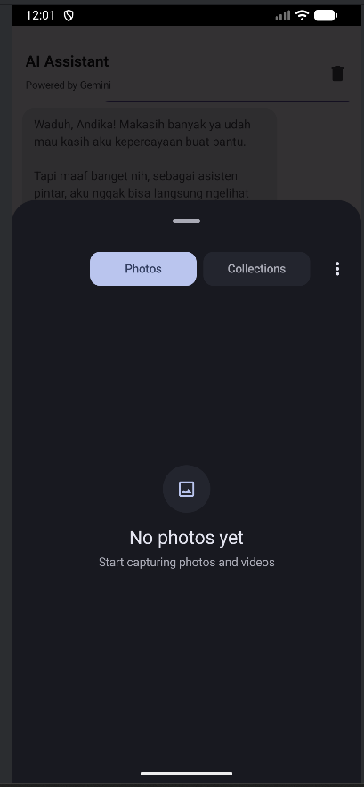
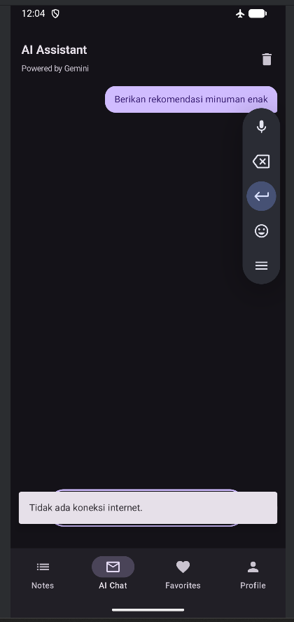

# Tugas 9 - Integrasi AI API
**Nama:** Andika Rahman Pratama  
**NIM:** 123140090  
**Prodi:** Teknik Informatika - ITERA

## Deskripsi
Aplikasi ini merupakan pengembangan dari Tugas 8 dengan penambahan fitur **AI Chat Assistant** menggunakan Google Gemini API. Tab baru ditambahkan di bottom navigation untuk fitur AI Chat, sementara semua fitur dari tugas sebelumnya tetap dipertahankan.

### Fitur Baru Tugas 9:
1. **AI Chat Assistant:** Tab baru berisi chatbot berbasis Gemini 2.5 Flash. User bisa mengetik pertanyaan dan mendapat jawaban dari AI langsung di dalam aplikasi.
2. **Multi-turn Conversation (Bonus +5%):** Riwayat percakapan disimpan selama sesi, AI mengingat konteks percakapan sebelumnya. User bisa menghapus riwayat lewat tombol di pojok kanan atas.
3. **Image Analysis (Bonus +10%):** User bisa memilih gambar dari galeri lewat tombol "+" di input area, lalu AI akan menganalisis dan mendeskripsikan isi gambar tersebut.
4. **Streaming Response (Bonus +5%):** Jawaban AI muncul secara bertahap (streaming), bukan menunggu seluruh respons selesai. Menggunakan SSE (Server-Sent Events) dari Gemini API.
5. **Error Handling:** Penanganan error untuk berbagai kasus: API key tidak valid (401), rate limit (429), tidak ada koneksi internet, dan error lainnya. Ditampilkan lewat Snackbar.
6. **Loading States:** Animasi typing indicator berupa tiga titik yang berkedip bergantian saat AI sedang memproses.
7. **System Prompt:** AI dikonfigurasi dengan system prompt sebagai asisten aplikasi MyProfileApp milik mahasiswa ITERA.

### Tech Stack:
- **Language:** Kotlin
- **UI Framework:** Jetpack Compose + Material 3
- **AI API:** Google Gemini 2.5 Flash
- **HTTP Client:** Ktor Client
- **Image Loading:** Coil
- **DI Framework:** Koin
- **Serialization:** kotlinx.serialization
- **Async:** Kotlin Coroutines & Flow
- **Database:** SQLDelight
- **Preferences:** DataStore

### Struktur File Baru (Tugas 9):
```
ai/
├── GeminiModels.kt      # Data class request & response (termasuk InlineData untuk gambar)
├── GeminiService.kt     # Service HTTP: chat, streaming, dan image analysis
└── AIRepository.kt      # Repository layer dengan system prompt
viewmodel/
└── ChatViewModel.kt     # State management chat, streaming, dan kirim gambar
screens/
└── ChatScreen.kt        # UI chat (bubble, image picker, typing indicator)
```

### Cara Setup API Key:
1. Buka [Google AI Studio](https://aistudio.google.com)
2. Klik **Get API Key** lalu **Create API Key**
3. Tambahkan baris berikut di file `local.properties`:
   ```
   GEMINI_API_KEY=your_api_key_here
   ```
4. Rebuild project


## Showcase

### Fitur AI Chat (Tugas 9)
| Empty State | Percakapan dengan AI | Typing Indicator |
| :---: | :---: | :---: |
|  |  |  |

| Image Analysis | Error Handling |
| :---: | :---: |
|  |  |